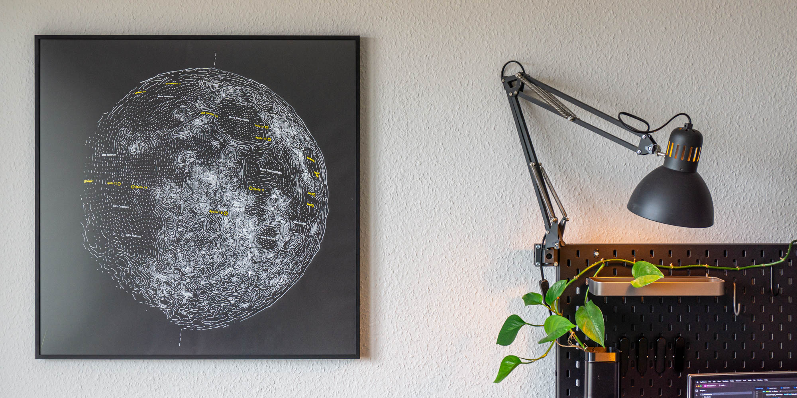

README christopher

Draw little planets: a pipeline to generate paths for pen plotters with elevation and color data of celestial bodies.



# Dependencies:

* [uv](https://docs.astral.sh/uv/), the python package manager
* [Inkscape](https://inkscape.org/), for SVG-to-PNG conversion
* Blender
* wget

On Linux you will need to modify BLENDER_BIN path in `makefile` or export it as an environment variable.

# Generate the SVGs

Blender path and inkscape path in Makefile

```sh
make setup run CONFIG_FILE=config/moon.toml DIR_BUILD=build_moon DIR_DATA=data_moon POI_FILES="config/moon_poi*.json" OUTPUT_PNG=moon.png
```

or

```sh
sh make_all.sh
```

# Config

Find the config files for each planet in [config][], example [moon/config.toml][].

Note: for Earth cloud overlays, a [Copernicus Climate Data Store](https://cds.climate.copernicus.eu/) API key is required (`~/.cdsapirc`).

# Misc Notes:

Drawing notes for dip mode:

* The metal nib needs to be cleaned regularly, otherwise dried paint will accumulate and the build up "widens" the the nib. This increases line strength and ultimately leads to big drops of paint. Cleaning after about 5 meters is a good tradeoff between regular cleaning and reducing maintenance time.
* The metal nib can tolerate only a limited drawing speed.

Plotter notes:

* Do not trust the perpendicularity of the plotter! The plotter (squareplot2) ALWAYS needs to be aligned with the cutting mat and fastened to the table surface with screw clamps (2 to the top, 1 for the lower horizontal extrusion profile), otherwise no 90 degree angle can be assumed.

---

Refer to a more extensive, but auto-generated ReadMe: [README_AUTOGEN.md][]. 

